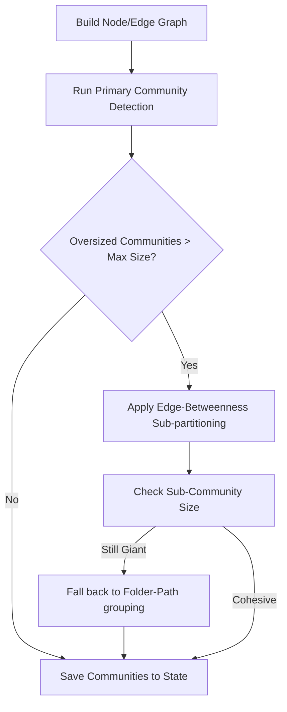

# Design

## Community Splitting & Fallback Architecture

If primary connected components yield oversized groups, the system splits them:

```typescript
export interface PartitionOptions {
  maxCommunitySize: number; // default: 50
  fallbackStrategy: 'folder_structure' | 'namespace';
}

export interface SplitCommunity {
  id: string;
  parentCommunityId?: string;
  nodeIds: string[];
  cohesionScore: number;
}
```



## Folder Path Fallback Strategy

When modular algorithms fail to resolve crisp edges, fallback parsing analyzes node metadata:

```typescript
function getPathFallbackCommunity(node: GraphNode): string {
  if (node.provenance && node.provenance.file) {
    const parts = node.provenance.file.split('/');
    // Group by first 2 levels of folder path (e.g. "src/controllers")
    return parts.slice(0, 2).join('/');
  }
  return 'default-global';
}
```

## Alternatives Considered

1. **Integrating heavy native Graph libraries (e.g. igraph)**: Rejected because compiling C++ node extensions is brittle on user machines (Windows/ARM). A pure JavaScript edge-betweenness centrality or folder-path grouping is lightweight and 100% portable.
