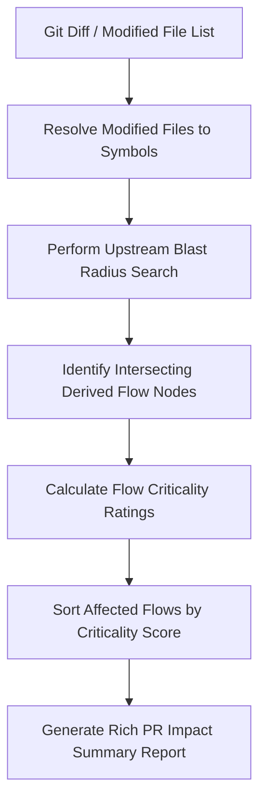

# Design

## Flow Criticality Weighting Formula

Every node within a derived business flow contributes to the overall flow criticality:

$$\text{Flow Criticality} = \sum_{n \in \text{Flow Nodes}} \text{Node Weight}(n)$$

Where:
- **`Node Weight`** is resolved based on node kinds:
  - Controller Endpoints / WebHooks: **+10**
  - Database Entity Mutators: **+8**
  - External Third-Party Integration Services: **+8**
  - Internal Service / Utility Helpers: **+2**

## Dynamic Impact Indexing

We build an inverse lookup index within the memory engine to map file paths to flows:

```typescript
export interface FlowCriticalityRecord {
  flowId: string;
  score: number;
  rating: 'low' | 'medium' | 'high' | 'critical';
  externalEndpoints: string[];
}

export interface AffectedFlowResult {
  flowId: string;
  criticality: FlowCriticalityRecord;
  affectedReason: string; // e.g. "Direct dependency on modified file Payment.cs"
}
```



## Alternatives Considered

1. **Relying on manual code comments**: Rejected because manual tagging gets outdated rapidly as developer teams modify dependencies. Dynamic graph centrality calculations are always accurate.
