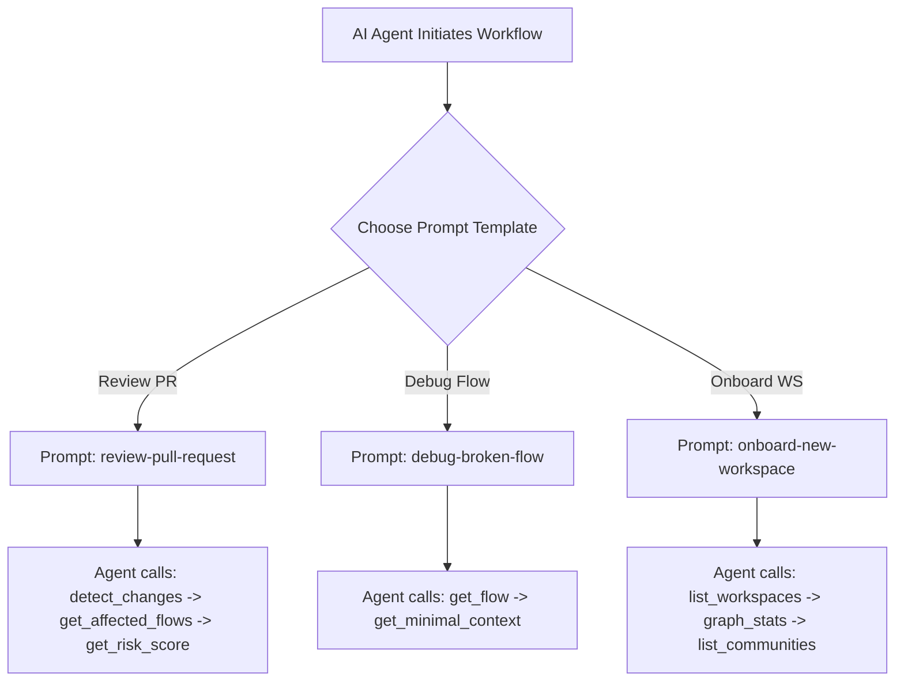

# Design

## MCP Prompts Specification

The MCP server implements the standard prompts listing and retrieval interface:

```typescript
export interface MCPPrompt {
  name: string;
  description: string;
  arguments?: Array<{
    name: string;
    description: string;
    required?: boolean;
  }>;
}
```

We register three core onboarding/review workflows:



## Review Pull Request Template Structure

```yaml
name: review-pull-request
description: Standard step-by-step PR review context gathering
template: |
  You are an expert code reviewer. To evaluate the impact of this PR:
  1. Call `detect_changes` with the target diff to map files to nodes.
  2. Call `get_affected_flows` to see which business flows are affected.
  3. Inspect highly critical flows with `get_flow` and calculate risk with `get_risk_score`.
  4. Ensure you only rely on canonical boundaries unless exploratory mode is explicitly authorized.
```

## Alternatives Considered

1. **Inline string arrays in TS**: Rejected because editing prompts directly in TypeScript code requires rebuilding the package. External `.yaml` template loaders make prompts highly customizable by users.
