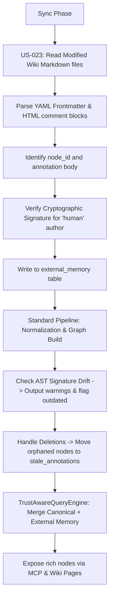

# Design

## Annotated Markdown Specification

Annotations are extracted from standard markdown wiki pages using YAML frontmatter or designated HTML markers:

```markdown
---
node_id: "CreateOrderUseCase"
workspace: "my-workspace"
annotations:
  - author: "human"
    comment: "This handles double-spend prevention through a Redis lock."
    confidence: "AUTHORITATIVE"
---

# CreateOrderUseCase

> [!NOTE]
> **AI Reflection (Memory)**:
> This class is heavily coupled with `PaymentService` and should be refactored.
> <!-- provenance: agent-id, confidence: INFERRED -->
```

## Database Storage Extension

Re-ingested facts are stored in `external_memory` and an orphan vault table `stale_annotations` for recovery:

```sql
CREATE TABLE IF NOT EXISTS external_memory (
  id TEXT PRIMARY KEY,
  node_id TEXT NOT NULL,
  workspace TEXT NOT NULL,
  author TEXT NOT NULL, -- 'human' | 'agent'
  annotation TEXT NOT NULL,
  provenance_info TEXT NOT NULL, -- JSON block
  confidence_band TEXT NOT NULL, -- 'AUTHORITATIVE' | 'INFERRED'
  verification_signature TEXT, -- HMAC signature to verify human source
  ast_signature_hash TEXT, -- MD5/SHA256 hash of AST shape at time of annotation
  last_updated TIMESTAMP DEFAULT CURRENT_TIMESTAMP
);

CREATE TABLE IF NOT EXISTS stale_annotations (
  id TEXT PRIMARY KEY,
  original_node_id TEXT NOT NULL,
  workspace TEXT NOT NULL,
  author TEXT NOT NULL,
  annotation TEXT NOT NULL,
  stale_reason TEXT NOT NULL, -- 'node_deleted' | 'project_removed'
  archived_at TIMESTAMP DEFAULT CURRENT_TIMESTAMP
);

CREATE INDEX IF NOT EXISTS idx_external_memory_node ON external_memory(node_id);
```

## Feedback Pipeline Flow



## Alternatives Considered

1. **Re-generating files and merging in-place**: Rejected because string-matching git merges in auto-generated files is highly error-prone and frequently results in merge conflict corruption. A dedicated database table (`external_memory`) avoids all file conflicts.
2. **ON DELETE CASCADE**: Rejected because refactoring source code would silently and permanently wipe out valuable manual developer commentary. An explicit `stale_annotations` vault table ensures safety.

