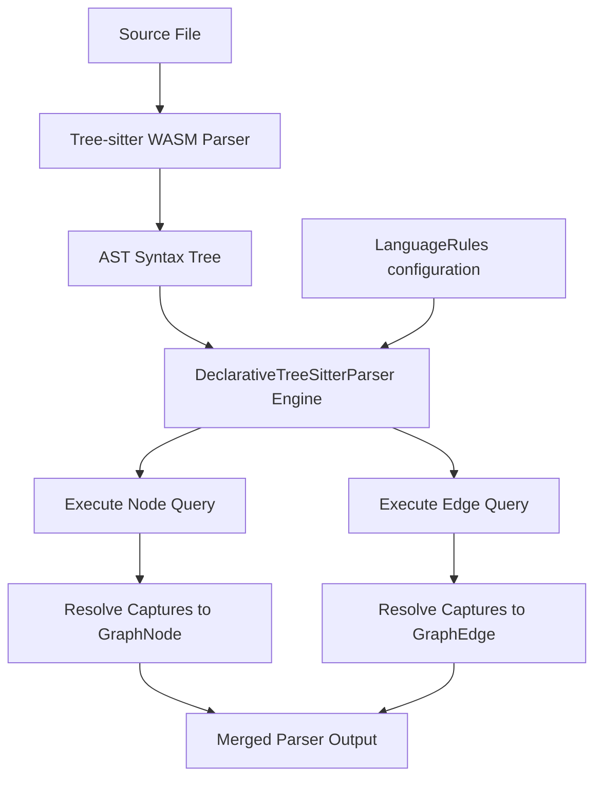

# Design

## Declarative Parser Schema

We introduce the `LanguageRules` model which outlines how tree-sitter captures are mapped to canonical graph structures:

```typescript
export interface CaptureMapping {
  captureName: string;
  nodeType: string;
  stableKeyTemplate: string; // e.g. "${namespace}.${className}.${methodName}"
  kind: 'canonical' | 'inferred' | 'external';
}

export interface LanguageRules {
  languageId: string;
  extensions: string[];
  queries: {
    // Tree-sitter query defining symbol nodes
    nodeQuery: string; 
    nodeMappings: CaptureMapping[];
    
    // Tree-sitter query defining edges (e.g. calls, inheritance)
    edgeQuery: string;
    edgeMappings: Array<{
      sourceCapture: string;
      targetCapture: string;
      edgeType: string;
    }>;
  };
}
```

## Parsing Flow

The parser runtime maps AST trees directly to nodes and edges:



## Data Schema Impact

None. It matches the standard `GraphNode` and `GraphEdge` structures outputted by `ILanguageParser`.

## Alternatives Considered

1. **Leveraging Babelfish/UAST formats**: Rejected due to high external dependency complexity and compiled binary requirements. Tree-sitter queries are natively supported by the workspace's node environment.
