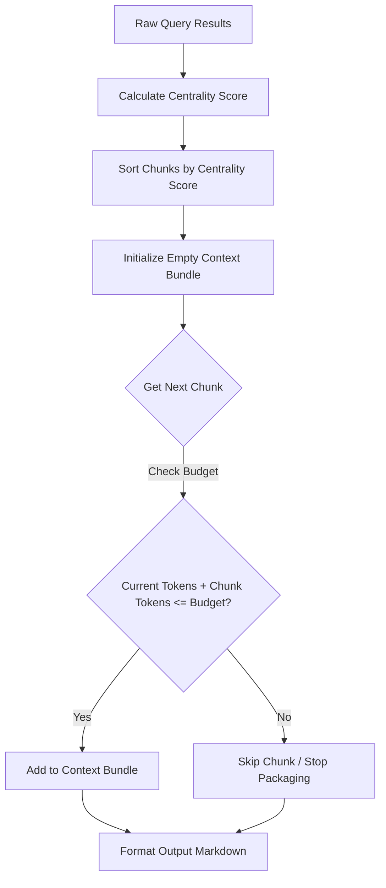

# Design

## Centrality & Budgeting Algorithm

The explorer processes queried nodes, calculates their weight, and packs them within a target token boundary:

```typescript
export interface ExplorationOptions {
  tokenBudget: number; // e.g. 8000
  centralityWeighting: boolean;
  priorityNodes?: string[]; // nodes to lock in context
}

export interface ContextChunk {
  nodeId: string;
  sourceCode: string;
  tokenCount: number;
  score: number;
}
```



## Token Estimation Strategy

Use a fast, standard character-to-token ratio approximation (e.g. 1 token ≈ 4 characters) to calculate tokens offline rapidly without introducing external tokenizer binary dependencies like `tiktoken` (which would breach our offline-first principle).

## Alternatives Considered

1. **Exact Tiktoken integration**: Rejected because compiling WASM tiktoken wrappers introduces excessive platform-specific binary dependencies on target environments (especially Windows/ARM configurations).
