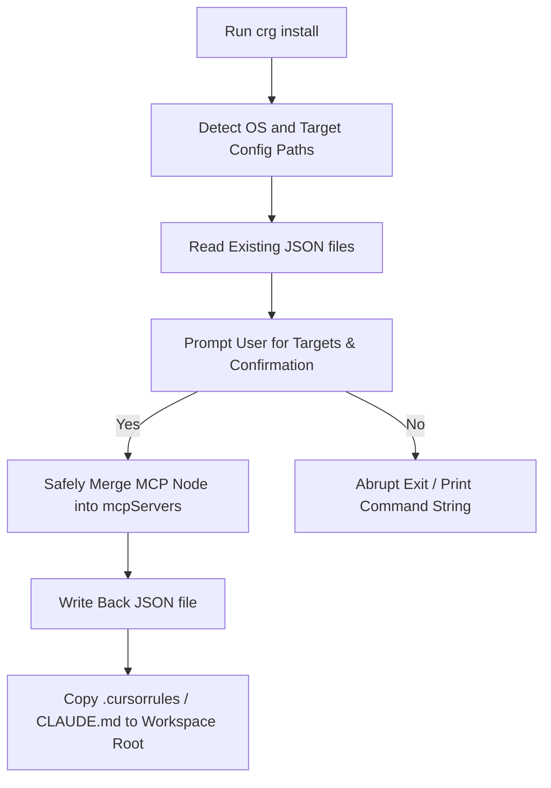

# Design

## Path Auto-Detection Matrix

The installer scans OS-specific paths to identify target clients:

| OS | Client | Target Path |
|---|---|---|
| **Windows** | Claude Desktop | `%APPDATA%\放\Claude\claude_desktop_config.json` |
| **Windows** | Cursor | `%APPDATA%\Cursor\User\globalStorage\storage.json` |
| **macOS** | Claude Desktop | `~/Library/Application Support/Claude/claude_desktop_config.json` |

## Merging Logic

Avoid destructive overrides. The installer reads the existing target JSON file, parses it, inserts the `code-review-graph` MCP server schema under `mcpServers`, and writes it back:

```json
{
  "mcpServers": {
    "code-review-graph": {
      "command": "node",
      "args": ["C:\\absolute\\path\\to\\crg\\dist\\mcp.js"],
      "env": {
        "CRG_WORKSPACE_ROOT": "C:\\active\\workspace"
      }
    }
  }
}
```



## Alternatives Considered

1. **Standalone script installer (`install.sh`/`install.ps1`)**: Rejected in favor of native CLI command `crg install` to ensure cross-platform execution via Node without execution policy restrictions on Windows.
