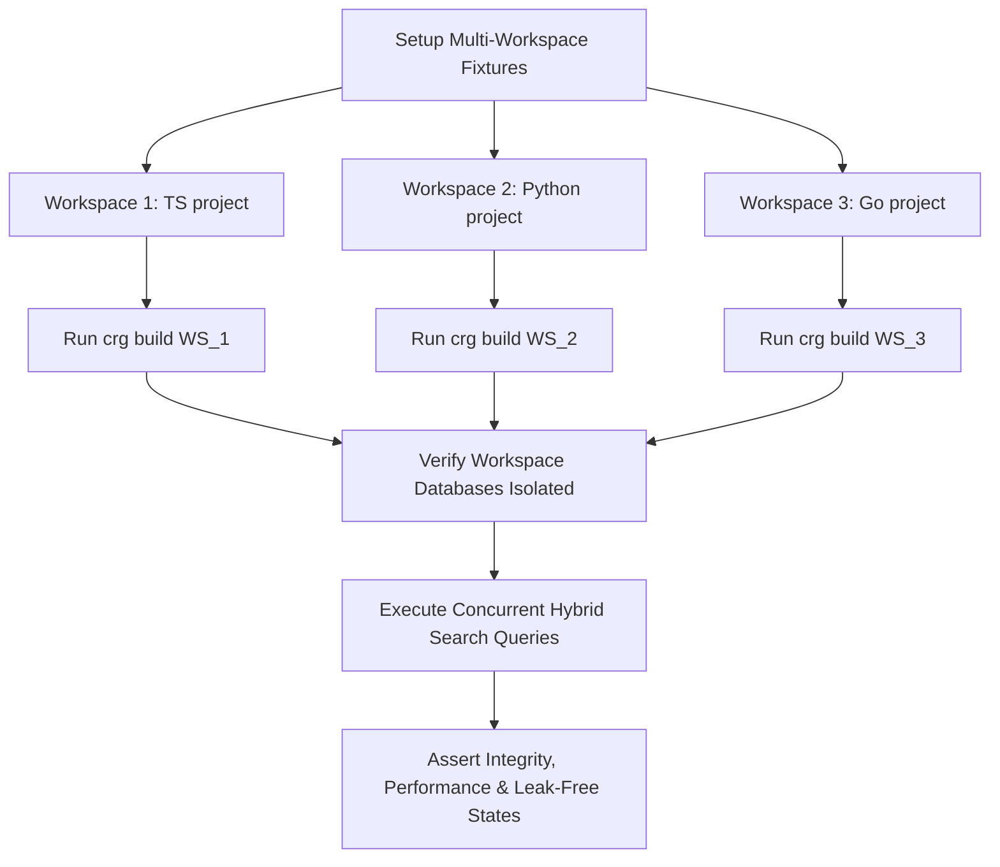

# Design

## Multi-Workspace Pipeline Validation Flow

The harness orchestrates parallel workspace runs and asserts security invariants:



## Isolation Invariant Checks

The testing framework explicitly runs:

```typescript
// Assert that a query for WS_1 never returns nodes carrying provenance metadata of WS_2
const leakedNodes = db.prepare(`
  SELECT count(*) as count FROM nodes 
  WHERE workspace = ? AND id IN (SELECT id FROM nodes WHERE workspace = ?)
`).get(workspace1, workspace2);
expect(leakedNodes.count).toBe(0);
```

## Alternatives Considered

None — E2E validation requires direct SQLite scans and environment validations.
